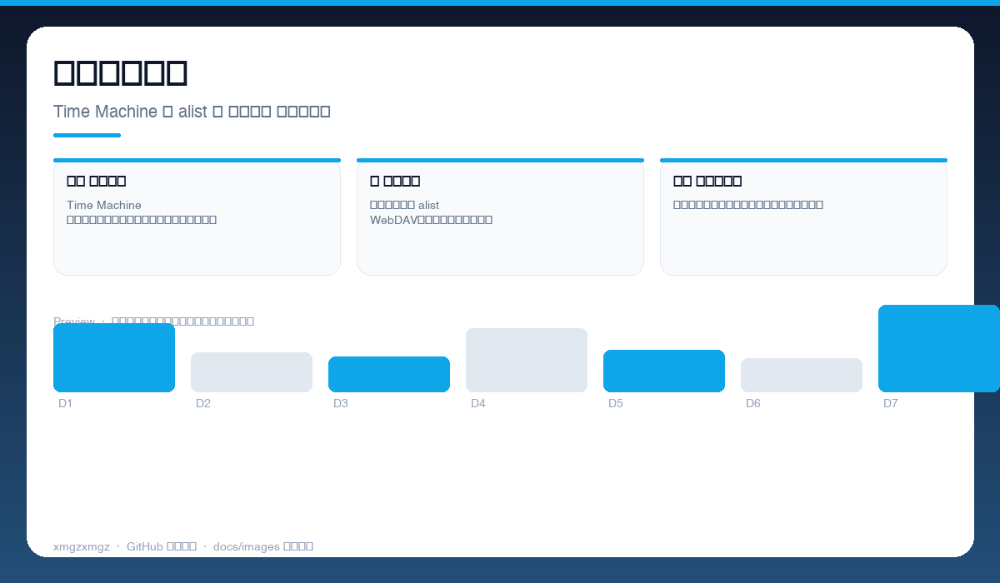
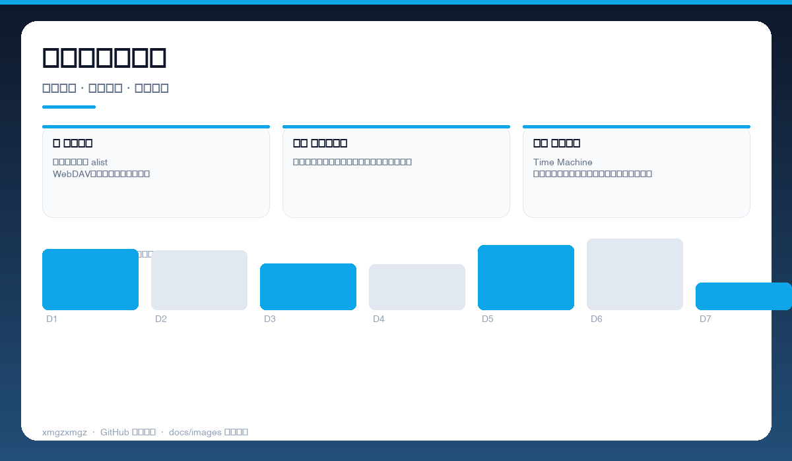
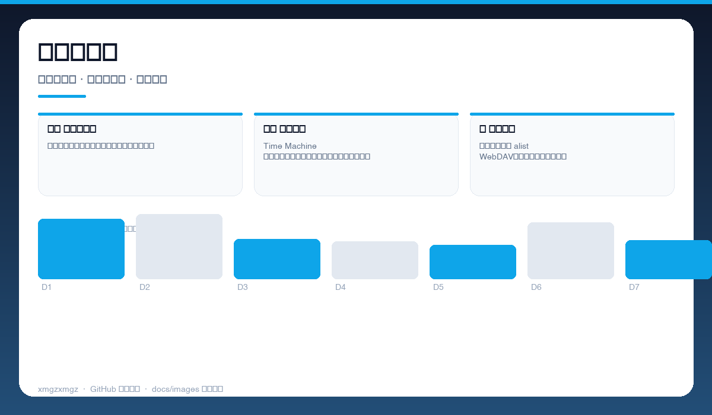

# 💾 alist-timemachine — alist-timemachine

> 让 Time Machine 直接备份到阿里云盘 — 告别移动硬盘，云端增量、自动挂载、开箱即用。

[](https://github.com/xmgzxmgz/alist-timemachine)
[](https://github.com/xmgzxmgz/alist-timemachine/releases)
[](LICENSE)
[](https://github.com/xmgzxmgz/alist-timemachine/actions/workflows/release.yml)

---

## ✨ 功能一览

| 模块 | 能力 | 状态 |
|------|------|------|
| ☁️ 云端备份 | Time Machine 稀疏镜像直存阿里云盘，无需本地大容量磁盘 | ✅ |
| ⚡ 自动挂载 | 开机自动挂载 alist WebDAV，断线重连、静默增量 | ✅ |
| 🛡️ 安全可回滚 | 保留多版本快照，支持加密稀疏束，一键恢复 | ✅ |

---

## 📸 功能预览

> 以下为自动生成的示意预览（无需本地部署截图），展示核心功能形态。

| 总览 | 细节 | 流程 |
|------|------|------|
|  |  |  |
| 云端备份总览 · Time Machine → alist → 阿里云盘 全链路可视 | 自动挂载与增量 · 开机自启 · 断线重连 · 后台增量 | 恢复与快照 · 多版本快照 · 加密稀疏束 · 一键回滚 |

<details>
<summary>查看大图</summary>


</details>

---

## 🚀 快速开始

```bash
git clone https://github.com/xmgzxmgz/alist-timemachine.git
cd alist-timemachine
chmod +x setup.sh && ./setup.sh  # 按提示填入 alist 地址与挂载点
```

---

## 🛠 技术栈

Shell · alist · macOS Time Machine · WebDAV · Sparse Bundle

---

## 🗂️ 目录结构（节选）

```
alist-timemachine/
├── docs/images/        # 本 README 的三张自动生成预览图
├── .github/workflows/  # Auto Release 自动发版
├── README.md
└── ...                 # 源码与配置
```

---

## 📦 Releases

本仓库已启用 **Auto Release**（`.github/workflows/release.yml`）：

- 推送 `v*` tag 自动发版：`git tag v0.2.0 && git push origin v0.2.0`
- 手动触发：`gh workflow run "Auto Release" -f version=v0.2.0`（留空则自动 patch +1）
- 变更说明自动生成（`--generate-notes`）

前往 [Releases](https://github.com/xmgzxmgz/alist-timemachine/releases) 查看。

---

## 🙏 相关项目

- [workbuddy-account-hub](https://github.com/xmgzxmgz/workbuddy-account-hub) — WorkBuddy 账户中枢（本 README 的样板）
- 更多见 [xmgzxmgz 主页](https://github.com/xmgzxmgz)

---

## 许可

MIT
